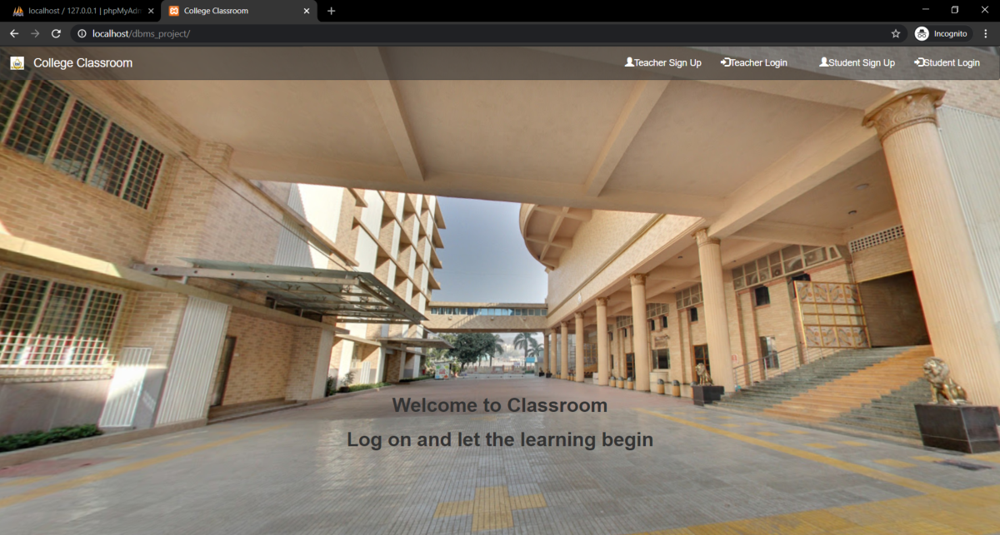
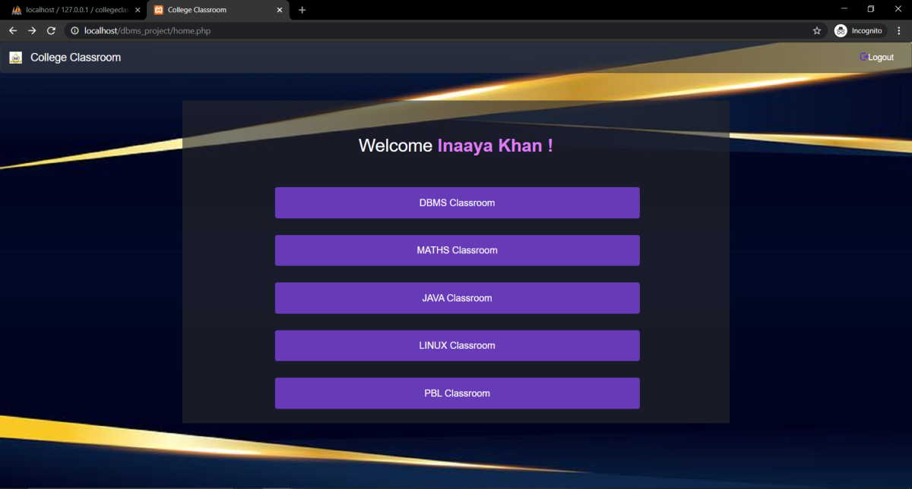
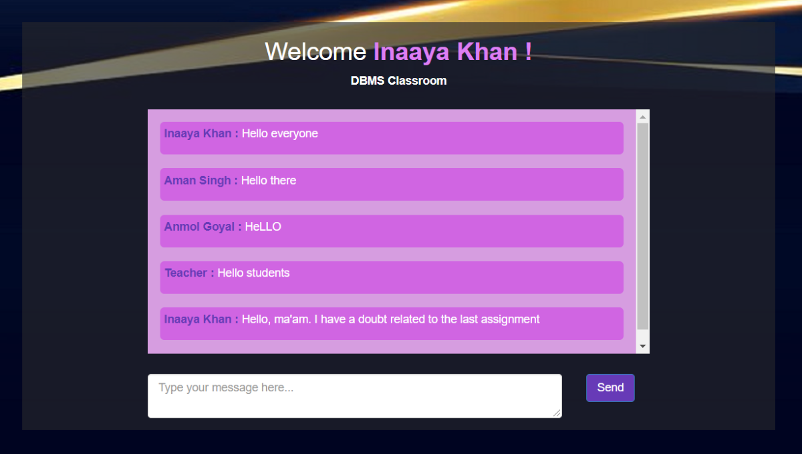
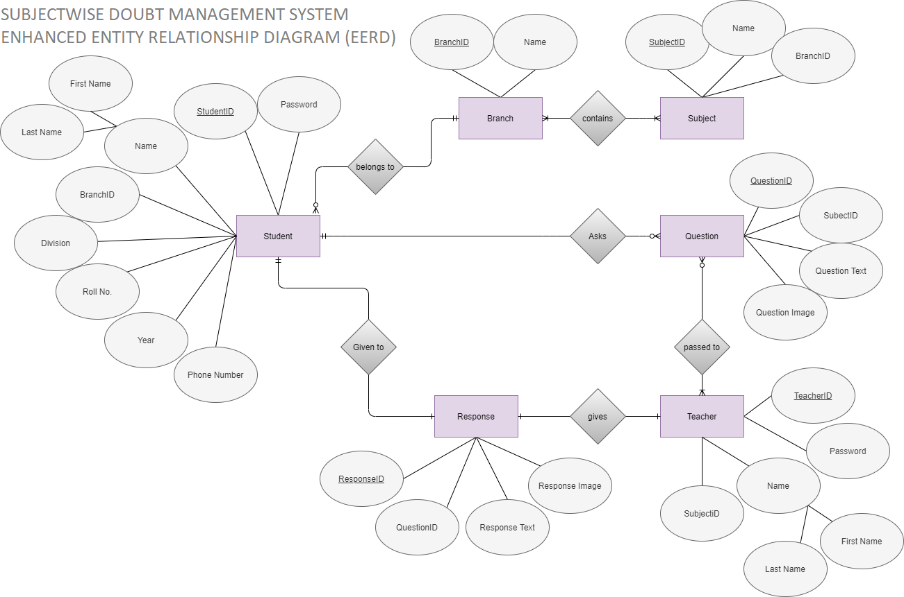

# Classroom Chatroom

A chat platform for university classes with separate logins for students and teachers. Each subject has its own chatroom, and all messages are logged.

**Tech:** PHP, MySQL, Bootstrap, HTML/CSS

**Context:** DBMS course project at the University of Mumbai, built independently.

| Landing page | Subject classrooms | Chatroom |
|---|---|---|
|  |  |  |

## Features

- Separate registration and login for students and teachers
- Pages for adding new students and teachers
- Subject-based chatrooms with message history

## Database design

Initial enhanced entity-relationship diagram (EERD) for the system:

## Setup

1. Install [XAMPP](https://www.apachefriends.org) and start **Apache** and **MySQL** in the XAMPP Control Panel.
2. Copy the `Project` folder to `C:\xampp\htdocs\` and rename it to `pbl_project`.
3. Open phpMyAdmin (**Admin** next to MySQL), create a database named `college_classroom` with collation `latin1_swedish_ci`.
4. Import `Project/database/college_classroom.sql` into that database.
5. Open [http://localhost/pbl_project/](http://localhost/pbl_project/).

A project presentation is included as `Project Presentation.pptx`.
